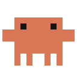
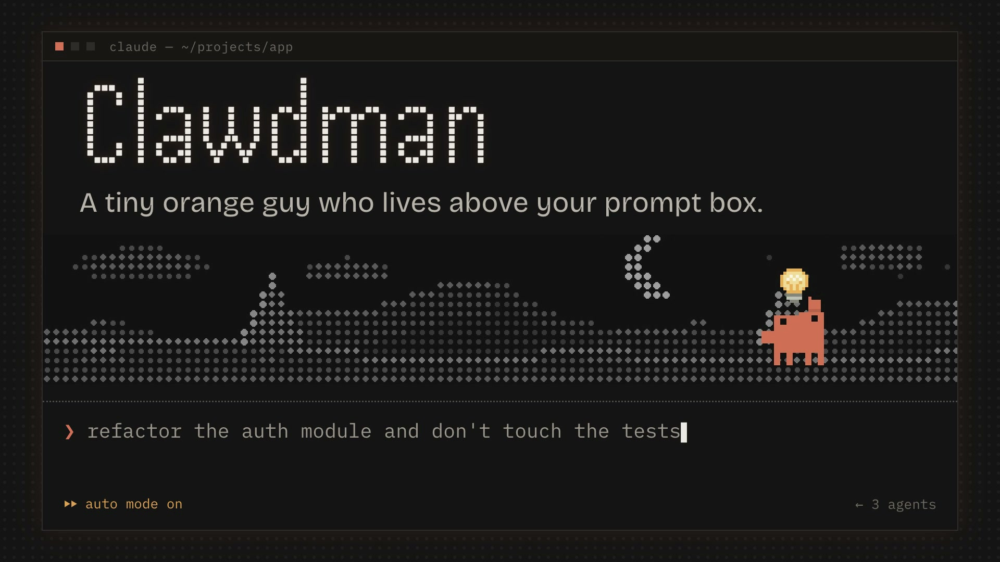
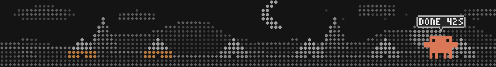
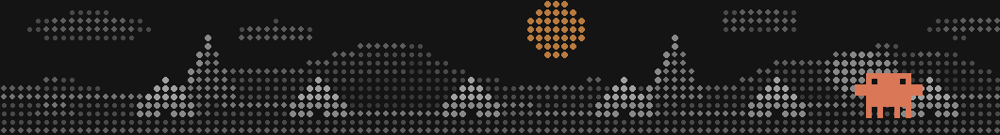
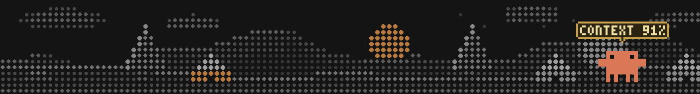
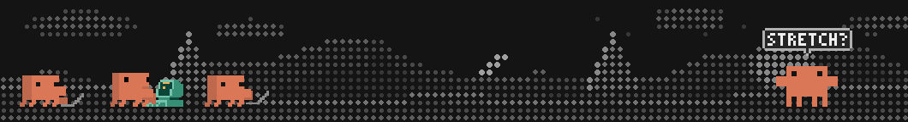

<p align="center"></p>
<h1 align="center">Clawdman</h1>

<p align="center"><em>a tiny orange guy who lives on top of your prompt box and has opinions.</em></p>

<p align="center"><a href="docs/clawdman.mp4"></a></p>
<p align="center"><sub>&#9654; Watch the 25-second tour. Every picture of the meadow in it is rendered by the plugin's own engine.</sub></p>


<p align="center"></p>
<p align="center"><sub>Night: a house for every changed file, and how long the turn took.</sub></p>

<p align="center"></p>
<p align="center"><sub>Day: the sun is out, and Clawd waves when Claude needs an approval.</sub></p>

<p align="center"></p>
<p align="center"><sub>Dusk: a low sun, stars, and a warning when the context window fills.</sub></p>

<p align="center"></p>
<p align="center"><sub>A desk for every subagent, and a stretch after a long session.</sub></p>

Your terminal was a lonely place. Just you, a blinking cursor, and a language model that never says "good morning."

Now there's **Clawd**: the Claude desktop app's little mascot, walking around a dotted moonlit meadow directly above your prompt. He waves. He strolls. He sits at a laptop and *pretends* to help while Claude works. He is, frankly, doing the bare minimum, and we love him for it.

> *Unofficial fan mod. Not made by, endorsed by, or related to Anthropic. Clawd's moves are the ones from the Claude desktop app, lovingly borrowed. Please don't send this to legal.*

---

## What he does all day

| When… | Clawd… |
|---|---|
| nothing is happening | waves hello, then goes for a stroll and does a random flourish every few seconds, like he's got somewhere to be |
| Claude is **editing files** | opens a laptop and types with great confidence |
| Claude is **running commands** | moves to a big desktop. serious business. |
| Claude is **reading stuff** | looks around suspiciously |
| Claude **needs your approval** | stops everything, waves, points, and holds up a bubble that says **NEEDS YOU**. he will not drop it. |
| a turn finishes | cheers, and tells you how long it took (`DONE 42S`) so you can feel something about it |
| a tool fails | facepalms. he has seen things. |
| **subagents** are running | a tiny extra Clawd appears at their own little desk, one per subagent. when the row gets crowded the desks squeeze together and a `+N` bubble counts the ones that don't fit. it's an office now. |
| your context window fills up | the **moon sinks** toward the horizon. when it's kissing the hills, your context is nearly gone. |
| a rate limit is close | the moon turns **amber**. this is the "maybe go outside" signal |
| it's daytime | there's a sun. at dusk and dawn it's low, with stars. at night, moon. he checks your actual clock. |
| files change in your repo | a **house** pops up for every changed file (up to 24; they squeeze together when there are a lot). white = changed, amber = staged. you are running a small village and the village is *messy* |
| Claude has been working for 50 minutes | he stretches, meditates, and asks `STRETCH?`. he cares about your posture more than you do |
| you **click** him | one of 21 reactions. double click for a bigger one. right click for a grumpy one. click 4 times fast and he gets dizzy. you monster. |
| you click the ground | he walks over there. he's very cooperative |

## Putting him on your terminal

From the marketplace in this repo:

```
claude plugin marketplace add therahul-yo/clawdman
claude plugin install clawdman@clawdman
```

Or straight from a local copy:

```
claude --plugin-dir /path/to/clawdman
```

Needs Claude Code 2.1.287 or newer (that's when mods arrived).

Clawd's meadow is an actual image, so your terminal has to be one that can show images (Ghostty, kitty, WezTerm and Herdr all can). Claude Code is shy about drawing them unless you say it's okay, so add this once to `~/.claude/settings.json`:

```json
{ "env": { "CLAUDE_CODE_FORCE_TERMINAL_IMAGES": "1" } }
```

No image support? Clawd shows up in **blocks** instead: same guy, chunkier meadow, a bit more "I was drawn in 1987." He still waves.

## Commands

| | |
|---|---|
| `/clawdman` | send Clawd away / bring him back |
| `/clawdman dots` · `/clawdman pixels` | the dotted meadow (default, the good one) or a solid pixel one (boxy, also good) |
| `/clawdman village on` · `off` | show or hide the houses |
| `/clawdman break 30` · `off` | minutes of Claude working before the stretch, or never, you rebel |
| `/clawdman renderer image` · `blocks` · `auto` | force pictures, force blocks, or let your terminal decide |
| `/clawdman fit 1.035` | stretch the meadow so its edges line up with your prompt box (pixel-perfectionists, this one's yours) |
| `/clawdman status` | Clawd's own report: what he sees, what he's feeling, whether anything broke |

## Frequently asked, mostly by me

**Is it going to slow down my typing?**
No. He freezes the moment you type something, the picture is a fixed height, and it's capped at about 11 frames a second. He respects your flow. He just also waves at you during it.

**Does it spy on my repo?**
Everything stays on your machine. The village runs `git status --porcelain` every 30 seconds, only while Clawd is on screen, and counts the files. Nothing is sent anywhere. He is nosy, not a snitch.

**What is the `[-]` in the corner?**
That's Claude Code's own collapse button for any plugin band. A plugin can't remove it. We tried. We asked nicely.

**Can he get more clothes / a hat / a second mountain?**
That's a pull request away.

## For the nerds

- Clawd's sprites are decoded from the app's own animation data.
- The meadow is a lattice of dots painted into **one indexed-colour PNG per frame**, by a tiny PNG writer (hash-chain LZ77 + fixed Huffman, written from scratch because we like pain) that lives in the plugin.
- Event hooks (`tool.call`, permission requests, `turn.complete`, …) pick the poses. A 3×5 pixel font draws the speech bubbles.
- 54 tests: `claude plugin test .` · validate with `claude plugin validate .`

*Made with dots, mild obsession, and a deep fear of empty space above a prompt box.*

## License

MIT for the code (see `LICENSE`). Clawd himself, his sprites and his animations come from the Claude desktop app and aren't covered by that license.
